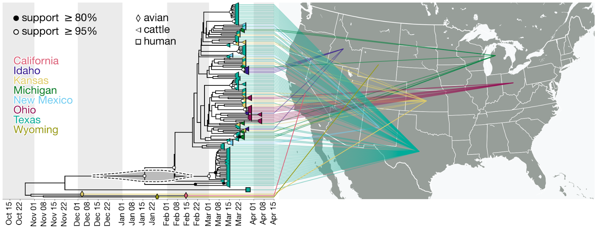

# Restructuring movement

```{r setup, include = FALSE}
knitr::opts_chunk$set(
  collapse = TRUE,
  echo = TRUE,
  comment = "#>",
  out.width = "65%",
  fig.width = 6,
  fig.height = 5
)

library(BirdFlowR)
library(terra)
library(ggplot2)
library(sf)
library(dplyr)
```

## Goal

Our goal is to estimate movement among polygons over a defined period of
time using a BirdFlow model.

The result will be a square movement matrix where the rows correspond to
starting polygons and the columns to ending polygons. Values are the
proportion of the total population making each movement, which can be
scaled to represent numbers of birds. Optionally each value can be
adjusted by the area of the two associated polygons to get a mean
movement per square kilometer.

The initial motivation to create this workflow was to model how
migratory wild birds might contribute to the spread of highly pathogenic
avian influenza (HPAI H5N1) among cattle in the United States.
Researchers used viral gene sequences to create a phylogeny of the
outbreak and infer interstate movements. They wanted to add a predictor
of wild bird movement rates to their model of viral movement.

```{r h5n1-phylogeny, echo = FALSE, out.width = "100%", fig.align = "center", fig.cap = "Time-calibrated phylogeny of H5N1 2.3.4.4b genome segment HA. Each genome is connected to the available geographic location in the United States. One genome sampled in the United States does not have state-level resolution and is colored the same as other genomes in North America. Violin centered on the most recent common ancestor (MRCA) of the viruses sampled in cattle represents the 95% highest posterior density (HPD) of the time of this most recent common ancestor (tMRCA)."}

```

Figure 4 from Worobey, M., et al. 2024. [Preliminary report on genomic
epidemiology of the 2024 H5N1 influenza A virus outbreak in U.S. cattle
(Part 1 of
2)](https://virological.org/t/preliminary-report-on-genomic-epidemiology-of-the-2024-h5n1-influenza-a-virus-outbreak-in-u-s-cattle-part-1-of-2/970).
*Virological*, 3 May 2024.

In the example here the polygons are US States, but the variable
(`polys`) and the sole required column name (`id`) are kept deliberately
generic so the code will work with any set of polygons.

### The approach:

1.  Load model, set start and end times for connectivity window, and set
    total population.
2.  Load and prepare state polygons
3.  Calculate the overlap between active cells in the BirdFlow model and
    the states.
4.  Generate starting distributions for each state that represent the
    portion of the overall species distribution that is in each state at
    the start of the movement.
5.  Run `predict()` using distributions and start and end time, to
    project each state's portion of the population forward.
6.  Drop time dimension from result preserving just the end
    distributions.
7.  Convert the ending distribution from model cells to states.
8.  Optionally, multiply by the species' total population (within the
    Americas) to convert from proportion of population to estimated
    number of birds
9.  Optionally, divide by the area of both the starting and ending state
    to make the estimates per unit area - eliminating the polygon size
    as a factor in the connectivity. This step is not appropriate for
    all use cases.

## Load model and set parameters

This example uses the American Woodcock dataset from the default model
collection.

```{r load BirdFlow model, set parameters}
bf <- load_model("amewoo")
start <- BirdFlowR::lookup_timestep("2024-01-15", bf)
end <- BirdFlowR::lookup_timestep("2024-03-20", bf)
population <- 3500000
```

## Load Polygons

Load state boundaries distributed with the BirdFlowModels package.

If you have a polygon shapefile already you could use
`polys <- sf::read_sf(shapefile_path)` and skip this section.

```{r echo = TRUE, eval = TRUE}
# Load state boundaries
polys <- BirdFlowModels::states

```

## Prepare polygons

- Add an `id` field; in this example it is the state names.
- Transform to match the BirdFlow Coordinate Reference System (CRS).
- Calculate the area in square kilometers of each polygon (`sq_km`).
- Add centroid coordinates (`x`, `y`) in the BirdFlow CRS.

```{r prepare polygons}

# Add generic "id" column (use state name)
polys$id <- polys$name

# Sort by id 
polys <- polys[order(polys$id), ]

# Transform to match the BirdFlow model CRS
polys <- sf::st_transform(polys, crs(bf))

# Calculate area in sq_km 
# This assumes the projection is in meters which is true for BirdFlow models
polys$sq_km <- as.vector(sf::st_area(polys)) / 1000^2

# Add centroids (only used for the plotting at end of document)
centroids <- sf::st_centroid(polys[, "geometry"]) |> sf::st_coordinates()
colnames(centroids) <- c("x", "y")
polys <- cbind(polys, centroids)

# Visualize over starting distribution
plot_distr(get_distr(bf, start), bf) + 
  geom_sf(data = polys, inherit.aes = FALSE, fill = NA) + 
  coord_sf(xlim = c(xmin(bf), xmax(bf)), ylim = c(ymin(bf), ymax(bf)), expand = FALSE)

```

## Calculate overlap between active BirdFlow cells and polygons

Make the `overlap` matrix. Rows correspond to BirdFlow active cells, and
columns to the state polygons. The values are the proportion of the cell
that overlaps the polygon.

```{r calculate overlap, echo = TRUE}

# Convert active cells to polygons
cell_polys <- rasterize_distr(seq_len(n_active(bf)), bf, format = "terra") |>
 terra::as.polygons() |>
  sf::st_as_sf()
names(cell_polys)[1] <- "i" # BirdFlow location index "i"

# Intersect cells with states
suppressWarnings( # Attribute values assumed to be spatially constant...
  intersection_polys <- sf::st_intersection(cell_polys, polys)
)
intersection_polys <- intersection_polys[, c("i", "id")]
intersection_polys$area <- sf::st_area(intersection_polys)
sq_m_per_cell <- prod(res(bf))
intersection_polys$prop_of_cell <- intersection_polys$area / sq_m_per_cell

# Calculate the proportion of each cell that overlaps each polygon
# Rows = active cells, columns = polygons
overlap <- matrix(0, nrow = n_active(bf), ncol = nrow(polys),
                  dimnames = list(i = seq_len(n_active(bf)),
                                  id = polys$id))
intersection_polys$row <- match(intersection_polys$i, seq_len(n_active(bf)))
intersection_polys$col <- match(intersection_polys$id, polys$id)
row_col_index <- intersection_polys[, c("row", "col")] |>
  sf::st_drop_geometry() |>
  as.matrix()
overlap[row_col_index] <- intersection_polys$prop_of_cell |> as.vector()


```

## Build initial distributions

This essentially clips the initial distribution separately to each
polygon while assigning values from boundary cells in proportion to
their overlap with the polygon.

Note, a single BirdFlowR distribution is a vector of length
`n_active(bf)`; multiple distributions can be stored in a matrix with
`n_active(bf)` rows. The matrix here has a column (distribution) for
each polygon in `polys`.

```{r }
# Create starting distribution matrix with a column for each state
# Initially each state has the full distribution for the species
start_distr <- matrix(get_distr(bf, start),
                              nrow = n_active(bf),
                              ncol = nrow(polys),
                              byrow = FALSE,
                              dimnames = list(i = seq_len(n_active(bf)),
                             start_poly = polys$id))

# Multiply by each State's overlap to clip out just the values for each state.
start_distr <- start_distr * overlap

```

```{r select largest, echo = FALSE, eval = TRUE}
# Select polygon that has the largest proportion of the initial distribution. It is used for visualizations.
start_proportion = colSums(start_distr)

# Top five states
head(sort(start_proportion, decreasing = TRUE))

sel <- which.max(start_proportion)


```

### Visualize the distribution for one polygon

Visualize the initial distribution for the polygon with the highest
initial abundance (`r polys$id[sel]`).

```{r visualize largest distribution, warning = FALSE, message = FALSE}
plot_distr(start_distr, bf, subset = sel) +
  ggplot2::geom_sf(data = polys,
                   inherit.aes = FALSE,
                   linewidth = 0.2,
                   color = "black",
                   fill = NA)
```

## Project the distributions forward

Use `BirdFlowR::predict()` to project the distributions forward. With
multiple input distributions the output will be a three dimensional
array. Select the last element of the third dimension to get just the
ending distributions in a matrix. The values in these distributions
represent the proportion of the population that started in the
corresponding polygon (columns) that ended in each active cell (rows).

```{r predict}

# Project distributions forward to end date
pred <- predict(bf, distr = start_distr, start = start, end = end)

# Just keep last distribution
end_distr <- pred[, , dim(pred)[3]]

# Restore dimension names
dimnames(end_distr) <- dimnames(start_distr)

```

### Visualize the ending distribution

This shows the ending distribution for the birds that started in
`r polys$id[sel]`.

```{r visualize ending distribution, message = FALSE, warning = FALSE}
plot_distr(end_distr, bf, sel) +
  ggplot2::geom_sf(data = polys,
                   inherit.aes = FALSE,
                   linewidth = 0.2,
                   color = "black",
                   fill = NA)
```

## Collapse the ending cells into ending polygons

Convert the `end_distr` destination cells into destination polygons
based on the overlap proportions in `overlap`.

The result is `move`: a matrix with rows for starting polygons, columns
for destination polygons, and values that are the proportion of the
total population making each transition.

```{r destination states}
# Each entry move[from, to] is the proportion of the total population
# that started in polygon "from" and ended in polygon "to".
move <- t(end_distr) %*% overlap
dimnames(move) <- list(from = polys$id, to = polys$id)
```

### Visualize the polygonized end distribution

Plot the proportion of the total population that moved from
`r polys$id[sel]` to each state.

```{r visualize polygon distr}
polys$Proportion  <- move[sel, ]

gradient_colors <-
      c("#EDDEA5", "#FCCE25", "#FBA238", "#EE7B51", "#DA596A", "#BF3984",
        "#9D189D", "#7401A8", "#48039F", "#0D0887")

ggplot2::ggplot(data = polys) +
  ggplot2::geom_sf(ggplot2::aes(fill = Proportion)) +
  ggplot2::scale_fill_gradientn(colors = gradient_colors) +
  ggplot2::ggtitle(paste0(species(bf), " movement from ", polys$id[sel]),
                   subtitle = paste0(lookup_date(start, bf), " to ",
                                     lookup_date(end, bf)))

```

## Adjust for population (optional)

You can multiply the movement by the total population of the species to
estimate the number of individuals making each movement. This is likely
necessary to aggregate or compare output across species.

```{r adjust for population}
# Convert to absolute numbers of Birds expected to move between
# each pair of polygons
move_count  <- move * population
```

## Adjust for area (optional)

Adjusting for area might be appropriate depending on the application. If
the goal is to capture the total magnitude of movement between each
source and destination polygon then do not adjust for area.

However, in our initial use case our points were in the specified states
but did not represent the entire state so failing to adjust for state
area would introduce a bias - essentially inflating movement for points
that fell in bigger states. Similarly if you want an average per unit
area movement between states that isn't biased by state area you would
adjust for area.

The adjustment is done by dividing the number of individuals moving
between the two polygons by the area of each polygon in sq km to produce
the expected number to move between them per sq km at each end. Clearly,
though, this does not capture the fine scale variability within them,
some of which is captured in the original BirdFlow cells.

```{r adjust for population and area}

# Adjust for area of both the source and destination polygons
n <- nrow(polys)
from_area <- matrix(polys$sq_km, n, n, byrow = FALSE)
to_area <- matrix(polys$sq_km, n, n, byrow = TRUE)
move_area <- move_count / from_area / to_area

```

## Visualize movement

```{r set plot threshold}
plot_count_threshold <- 1000 # only plot lines for big movements
```

Plot non-zero estimated counts of birds moving between polygons and
indicate magnitude with line thickness. Lines are only shown for
movements of at least `r plot_count_threshold` individuals.

```{r plot connections}
n <- nrow(polys)
long <- data.frame(from =  rep(polys$id, times = n),
                   to = rep(polys$id, each = n),
                   count = as.vector(move_count))

# Add coordinates of centroids of to and from polygons

coords <- select(polys, "id", "x", "y") |> 
  sf::st_drop_geometry()

# Add from coordinates 
long <- left_join(long, coords, join_by(from == id)) |> rename(f_x = x, f_y = y)

# Add to coordinates 
long <- left_join(long, coords, join_by(to == id)) |> rename(t_x = x, t_y = y)

long <- long[long$count >= plot_count_threshold, ]

ggplot2::ggplot(long) +
  ggplot2::geom_segment(ggplot2::aes(x = f_x, y = f_y,
                                     xend = t_x, yend = t_y,
                                     linewidth = count),
                        color = rgb(0, 0, 0, .25)) +
  ggplot2::scale_linewidth(range = c(0.2, 4)) +
  ggplot2::theme(axis.title = ggplot2::element_blank(),
                 strip.background = ggplot2::element_blank()) +
  ggplot2::geom_sf(data = polys,
                   inherit.aes = FALSE,
                   linewidth = 0.2,
                   color = "black",
                   fill = NA)
```

## Exercises

### 1. Change the time window and/or species

`start` and `end` are the only things that define the movement period.

a.  Re-run with a fall window (say 2024-09-01 to 2024-11-15). How does
    the pattern change?
b.  Try another species. Use
    `load_collection_index() |> select("species_code", "common_name")`
    to list available models.
c.  Instead of hard-coded dates, use a named season. `predict()` passes
    its time arguments through to `lookup_timestep_sequence()`, so
    `season = "prebreeding"` works in place of `start` and `end`.

### 2. Understand the movement matrix

a.  What does `sum(move)` equal, and why? What about `sum(move[sel, ])`?
b.  What do the diagonal entries `diag(move)` represent? For this
    species and time window, is most of the population staying put or
    moving between states?
c.  Row sums and column sums answer two different questions. Which is
    "where did the birds in this state go?" and which is "where did the
    birds now in this state come from?"

```{r diagonals}
sum(move)
sum(diag(move)) / sum(move)   # proportion staying in their starting state
head(sort(rowSums(move), decreasing = TRUE))
```

### 3. Net movement between states

The matrix is not symmetric — `move["North Carolina", "Michigan"]` need
not equal `move["Michigan", "North Carolina"]`. Compute the net exchange
and find the biggest net exporters and importers of birds over this
window.

``` r
net <- move - t(move)          # net[i, j] = net flow from i to j
net_out <- rowSums(net)        # positive = net exporter
```

Which states have the largest net outflow? Does that match what you know
about American Woodcock migration in late winter?

### 4. Does the area adjustment change your conclusions?

Rank the top 20 movements by `move_count`, then again by `move_area`,
and compare the two lists.

a.  Which states enter the top 20 only after adjusting for area? Which
    drop out?
b.  For the HPAI use case described in the overview — sampled points
    within states, not whole states — which ranking is the appropriate
    one, and why?

## Solutions

### 1. Rerun with other parameters

Change the lines 91:93 and rerun. The result will depend on the
time frame and species you pick.

### 2. Understand the movement matrix

**a. `sum(move)` is *not* 1.**

```{r solution sums}
sum(get_distr(bf, start))   # the model distribution does sum to 1
sum(start_distr)            # after clipping to states
sum(move)                   # after projecting and collapsing to states
```

Density is lost at two separate points, and both are due to polygon
coverage:

1.  **At the start.** `start_distr <- start_distr * overlap` keeps only
    the share of each cell that falls inside some state. Cells over
    Canada, Mexico, and the ocean are zeroed, so `sum(start_distr) < 1`.
2.  **At the end.** `move <- t(end_distr) %*% overlap` applies the same
    clipping to the destinations. Birds that ended outside the polygon
    set are dropped.

`predict()` itself conserves density — `sum(end_distr)` equals
`sum(start_distr)`. So `sum(move)` is the
proportion of the population that both started *and* ended inside the
polygon set. A low value means your polygons do not cover much of the 
overall species distribution.

For the same reason `sum(move[sel, ])` is *less than*
`colSums(start_distr)[sel]`:

```{r solution row sums}
colSums(start_distr)[sel]     # started in this state
sum(move[sel, ])              # ends up somewhere in the polygon set

```

The difference is the share of `r polys$id[sel]`'s birds that left the
polygon set entirely.

```{r solution overlap coverage}
# Cells fully inside a state have rowSums(overlap) == 1; edge and
# outside cells are less. Values slightly over 1 reflect small
# overlaps in the low-resolution state boundaries.
summary(rowSums(overlap))
```

**b. The diagonal is birds that stayed.**

```{r solution diagonal}
sum(diag(move)) / sum(move)
```

Only a small fraction of the population ends the window in the state it
started in, so for this species and window the great majority moved
between states. That is expected: mid-January to late March covers the
bulk of Woodcock spring migration. Widen the window and the diagonal
shrinks further; narrow it and the diagonal grows, because the diagonal
is really measuring "not enough time to leave."

**c. Rows are origins, columns are destinations.**

- `rowSums(move)` — for each *starting* state, where did its birds go?
  This is "where did the birds in this state go?" It is dominated by
  states that held a lot of birds at `start`.
- `colSums(move)` — for each *ending* state, where did its birds come
  from? This is "where did the birds now in this state come from?"

```{r solution margins}
head(sort(rowSums(move), decreasing = TRUE), 4)   # biggest sources
head(sort(colSums(move), decreasing = TRUE), 4)   # biggest destinations
```

Sources are southern, destinations are shifted north.

### 3. Net movement between states

```{r solution net}
net <- move - t(move)
net_out <- rowSums(net)

head(sort(net_out, decreasing = TRUE), 6)   # net exporters
head(sort(net_out), 6)                      # net importers
```

The net exporters are the southeastern wintering states and the net
importers are northeastern and midwestern breeding states.

A state can have a large gross exchange and near-zero net flux.
Compare `net_out` against `rowSums(move) + colSums(move)` to separate
"busy" states from "directional" ones.

### 4. Does the area adjustment change your conclusions?

```{r solution area ranking}
top_pairs <- function(m, k = 20) {
  idx <- order(m, decreasing = TRUE)[seq_len(k)]
  data.frame(from = rownames(m)[row(m)[idx]],
             to = colnames(m)[col(m)[idx]],
             value = m[idx])
}

by_count <- top_pairs(move_count)
by_area  <- top_pairs(move_area)

head(by_count, 5)
head(by_area, 5)
```

**a.** The two rankings barely agree.

```{r solution area compare}
# How many of the top 20 pairs are shared?
length(intersect(paste(by_count$from, by_count$to),
                 paste(by_area$from, by_area$to)))

# States that appear only after adjusting for area
# These are generally small states
setdiff(unique(c(by_area$from, by_area$to)),
        unique(c(by_count$from, by_count$to)))

# States that drop out
# These are generally big states
setdiff(unique(c(by_count$from, by_count$to)),
        unique(c(by_area$from, by_area$to)))
```

Adjusting for area promotes the small northeastern states and demotes the large midwestern and southern ones. 
Unadjusted counts are partly just a measure of how big a state is.

```{r solution smallest states}
polys |> sf::st_drop_geometry() |> dplyr::arrange(sq_km) |>
  dplyr::select(id, sq_km) |> head(5)
```

**b.** For the HPAI use case, the **area-adjusted** ranking is the
appropriate one. The viral sequences came from specific points — a herd,
a barn — not from whole states. The quantity the epidemiological model
needs is something like "the rate of wild-bird movement between this
location and that location," and using unadjusted totals would make a
sampled point in Texas look better connected than an identical point in
Rhode Island purely because Texas is larger. 

Use the unadjusted `move_count` when the question really is about whole
polygons — for example total birds arriving in a state, for a
state-level surveillance or harvest calculation.

**A caveat** Dividing by area assumes birds are spread evenly
within a polygon, which they are not. The BirdFlow cells carry
within-state structure that both `move_count` and `move_area` throw
away. If within-polygon variation matters for your question, work with
`end_distr` at cell resolution instead of collapsing to polygons at all.
