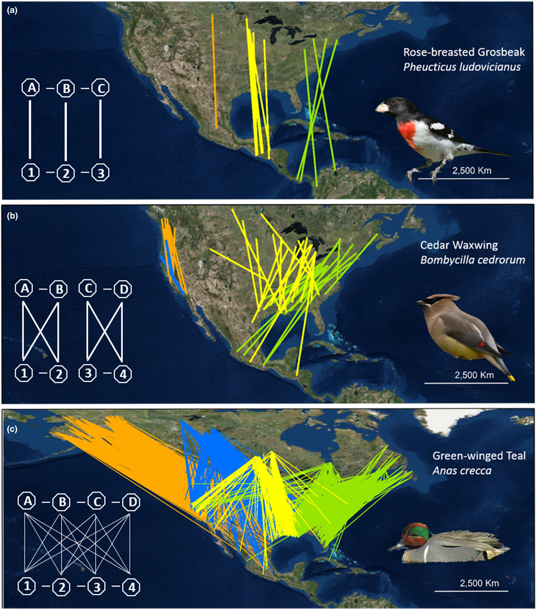

```{=html}
<style type="text/css">
  body {
    font-family: "Helvetica Neue", Helvetica, Arial, sans-serif;
    font-size: 18px;
  }
  h1 {
    font-size: 28px;
    color: #2c3e50;
  }
  h2 {
    font-size: 24px;
    color: #2c3e50;
  }
  code.r {
    font-size: 14px;
  }
</style>
```

```{r setup, include=FALSE}
knitr::opts_chunk$set(echo = TRUE, warning = FALSE, message = FALSE)
knitr::opts_chunk$set(cache = TRUE)
```

# Introduction

Migration connectivity describes both the pattern, the geographic linking of populations between seasons (i.e. transition probabilities), and the strength, the extent that popualtions remain cohesive between seasons (i.e. MC metric) (Cohen et al. 2019, Hostetler et al. 2025).

```{r}

```

High Positive Score ($MC \approx +1$): Strong Connectivity: Birds from the same breeding area all migrate to the same wintering ground Their relative distances don't change, neighbors stay neighbors.

Score Near Zero ($MC \approx 0$): Low Connectivity / Mixing: Birds from the same breeding area scatter all over the place, mixing completely with birds from other breeding grounds/population

In this session, we will explore how to use BirdFlow models to study migratory connectivity.
We will cover:

1\.
Loading a pre-trained BirdFlow model for a specific species.\
2.
Loading raw tracking data and snapping it to the BirdFlow grid.\
3.
Visualizing the observed migratory routes.\
4.
Generating connectivity metrics across the species' full range and throughout the season.

# 1. Select and Load the BirdFlow Model

While in research, it involves tuning and selecting the best model among many candidate models, we will skip that step today and load a pre-selected model that has already been validated.
For this tutorial, we will look at the Long-billed Curlew (lobcur).

```{r}
# Load necessary libraries
invisible(lapply(c("dplyr", "ggplot2", "rnaturalearth", "terra", "sf", "BirdFlowR", "readr", "purrr", "janitor", "lubridate", "tidyr"), library, character.only = TRUE))

# Source custom connectivity functions
source("./calc_route_mc.R")
source("./calc_interval_mc.R")
source("./calc_birdflow_mc.R")

# Load world map for visualizations
world <- ne_countries(scale = "medium", returnclass = "sf")

# Migration Connectivity Region (this envelops Bird Conservation Region)
mcr = st_read("./MigConnReg_Audubon/con_reg_small.shp") |> st_transform(crs = 4326) |> mutate(MCR_Code = as.factor(MCR_Code))
```

```{r}
name <- "lobcur"

# Import the BirdFlow model
bf <- import_birdflow("./lobcur_2023_100km_obs1.0_ent0.0020202_dist0.0080808_pow0.9.hdf5")
print(bf)
bf$species
```

# 2. Load and Convert Tracking Data

Next, we will load two sets of tracking data for this species.
Researchers having tracking data from one or a few study sites can extrapolate those observations to population-level movement patterns using BirdFlow models.

Tracking data of Long-billed Curlew were downloaded from these sources: Jay Carlisle.
Long-billed Curlew Migration from the Intermountain West.
<https://www.movebank.org/cms/webapp?gwt_fragment=page=studies,path=study42451582>

Tibbitts, T.L., Page, G.W., Warnock, N., Douglas, D.C., 2024, Tracking data for Long-billed Curlews (Numenius americanus) (ver 1.0, February 2024): U.S.
Geological Survey data release, <doi:10.5066/P9Q85XOM>.
<https://www.movebank.org/cms/webapp?gwt_fragment=page=studies,path=study1953194738>

First, we must "snap" the raw coordinates to the spatial grid and temporal mid-weeks defined by our loaded BirdFlow object.

```{r}
# Load the tracking data RDS
new_tracking_files <- list.files("./", pattern = "\\.csv$")
matching_files <- new_tracking_files[grepl(name, new_tracking_files)]
full_paths <- file.path(matching_files)

# Read, clean, and bind all matched files
tracking_data <- map_dfr(full_paths, ~ {
  read.csv(.x) %>%
    clean_names() %>%
    filter(location_lat != 0 & location_long != 0) %>%
    transmute(
      date = ymd_hms(timestamp),
      lat = location_lat,
      lon = location_long,
      route_id = as.character(individual_local_identifier),
      route_type = "tracking"
    ) %>%
    filter(between(lon, -180, 180), between(lat, -90, 90)) %>%
    na.omit()
})
```

```{r}
# Convert raw data into a BirdFlowRoutes object
routes_obj <- BirdFlowR::Routes(tracking_data, species = name)
birdflow_routes_obj <- routes_obj |> 
  BirdFlowR::as_BirdFlowRoutes(bf = bf, aggregate = "midweek") # The observation that is closest to the middle of the week is used to represent the week.
```

```{r}
# Visulize the tracking data after it's snapped to the BirdFlow grid
df2 = birdflow_routes_obj$data
ggplot() +
      geom_sf(data = world, fill = "grey", alpha = 0.5) +
      #facet_wrap(~beginYear)+
      geom_path(data = df2, 
                aes(x = lon, y = lat, group = route_id, color = route_id),
                size = 0.5, alpha = 0.7) +
      geom_point(data = df2, 
                 aes(x = lon, y = lat, color = route_id),
                 size = 0.5, alpha = 0.9) +
      coord_sf(xlim = range(df2$lon, na.rm = TRUE) + c(-2, 2),
               ylim = range(df2$lat, na.rm = TRUE) + c(-2, 2),
               expand = FALSE) +
      theme_minimal() +
      scale_color_viridis_d()+
      labs(x = "Longitude", y = "Latitude") +
      theme(legend.position = "none")
```

```{r}
# Filter for the postbreeding season and remove stationary points
list_filtered <- time_filter(birdflow_routes_obj, bf = bf, season = "postbreeding")
# allow a track to start as early as breeding season, and end as late as nonbreeding season
# but find the nearest to both ends of postbreeding season if the track is long 

origin_target <- list_filtered$origin_target |> 
  filter(i1 != i2) # Filter out individuals that didn't move
```

# 3. Calculate observed migration connectivity strength

Now that our data aligns with the BirdFlow grid, let's first visualize the observed postbreeding migration routes.
We will map the starting locations (origins) to their ending locations (targets) using connecting lines.

```{r}
ggplot() +
  geom_sf(data = world, fill = "gray95", color = "gray80") +
  geom_segment(data = origin_target, 
               aes(x = lon1, y = lat1, xend = lon2, yend = lat2),
               arrow = arrow(length = unit(0.2, "cm")), 
               alpha = 0.7, color = "#3A8FB7") +
  coord_sf(xlim = c(-130, -90), ylim = c(15, 55)) +
  theme_minimal() +
  labs(title = paste("Observed Postbreeding Routes:", name),
       x = "Longitude", y = "Latitude")
```

We can calculate connectivity strength based on connectivity pattern.
This method is based on Cohen, Emily B., et al. "Quantifying the strength of migratory connectivity." Methods in Ecology and Evolution 9.3 (2018): 513-524.

$$MC = \sum_{k=1}^{S2} \sum_{l=1}^{S2} \left( \sum_{i=1}^{S1} \sum_{j=1}^{S1} (R_i \psi_{ik}) \, D^*_{ij} \, (R_j \psi_{jl}) \right) V^*_{kl}$$ $R_i \psi_{ik}$ and $R_j \psi_{jl}$ are movement probabilities between i-k and j-l.

Where the standardized origin distances (how far apart Bird i and Bird j live from each other, i.e. $D_{ij}$) and target distances (how far apart they end up after migrating $V_{kl}$) are defined as:

$$D^*_{ij} = \frac{D_{ij} - \mu_D}{\sigma_D} \quad \text{and} \quad V^*_{kl} = \frac{V_{kl} - \mu_V}{\sigma_V}$$

```{r}
calc_interval_mc(origin_target, bf)
```

# 4. Simulate routes from selected BirdFlow model

Now that we have our observed starting locations, we can ask the BirdFlow model to simulate migration routes starting from those exact same coordinates.

```{r}
# Filter origins to ensure they are valid starting locations for the model
valid_rows <- is_location_valid(bf, 
                                x = origin_target$x1, 
                                y = origin_target$y1, 
                                timestep = origin_target$timestep1)
origin_target_valid <- origin_target[valid_rows, ]

# Simulate routes from these valid origin points
# We simulate 1 route per origin (n = 1), but you can adjust this to generate more variation
sim_rts <- BirdFlowR::route(bf, 
                            n = 1, 
                            x_coord = origin_target_valid$x1, 
                            y_coord = origin_target_valid$y1,
                            start = origin_target_valid$timestep1[1],
                            end = origin_target_valid$timestep2[2],
                            from_marginals = TRUE)

# Convert the simulated routes into an origin-target dataframe for plotting
sim_origin_target <- make_origin_target_df(sim_rts)

# Plot the simulated routes
ggplot() +
  geom_sf(data = world, fill = "gray95", color = "gray80") +
  geom_segment(data = sim_origin_target, 
               aes(x = lon1, y = lat1, xend = lon2, yend = lat2),
               arrow = arrow(length = unit(0.2, "cm")), 
               alpha = 0.7, color = "#9E72C3") +
  coord_sf(xlim = c(-130, -90), ylim = c(15, 55)) +
  theme_minimal() +
  labs(title = paste("Simulated Postbreeding Routes:", name),
       x = "Longitude", y = "Latitude")

# Calculate connectivity strength based on simulated connectivity pattern
calc_interval_mc(sim_origin_target, bf)
```

Animate the movement pattern of the entire population

```{r}
rts = route(bf, 100, season = "postbreeding")
#plot_routes(rts)

anim = animate_routes(rts, bf)
timesteps <- unique(rts$data$timestep)
gif <- gganimate::animate(anim,
                          device = "ragg_png", # is fast and pretty
                          width = 6, height = 4.5,
                          res = 150, units = "in",
                          nframes = length(timesteps) * 4, fps = 8)
gif_file <- paste0("./", name, "_postbreeding", ".gif")
gganimate::save_animation(gif, gif_file)
knitr::include_graphics(gif_file)
```

```{r}
rts = route(bf, 100, season = "prebreeding")
#plot_routes(rts)

anim = animate_routes(rts, bf)
timesteps <- unique(rts$data$timestep)
gif <- gganimate::animate(anim,
                          device = "ragg_png", # is fast and pretty
                          width = 6, height = 4.5,
                          res = 150, units = "in",
                          nframes = length(timesteps) * 4, fps = 8)
gif_file <- paste0("./", name, "_prebreeding", ".gif")
gganimate::save_animation(gif, gif_file)
knitr::include_graphics(gif_file)
```

# 5. Full Range Connectivity Metrics

## Full population movement

```{r}
rts = route(bf, 100, season = "all")
plot_routes(rts)
```

We can calculate the overall Migration Connectivity (MC) metric for the entire population using the BirdFlow model.
A higher MC value generally indicates stronger connectivity (e.g., populations that breed close together also winter close together).

```{r}
fall_mc <- calc_birdflow_mc(bf, season = "postbreeding")
spring_mc <- calc_birdflow_mc(bf, season = "prebreeding")

cat("Postbreeding MC:", round(fall_mc, 3), "\n")
cat("Prebreeding MC:", round(spring_mc, 3), "\n")
```

## Seasonal Connectivity Dynamics

Connectivity isn't just a static number; it changes as birds move throughout the season.
By calculating MC cumulatively week by week, we can see how the population mixes or segregates over time.

```{r}
results_df <- data.frame()

# Get the sequence of timesteps for the postbreeding season
timesteps <- lookup_timestep_sequence(bf, season = "postbreeding")
start_time <- timesteps[1]

# Loop through each subsequent timestep to calculate MC from the start
for (e in timesteps[1:length(timesteps)]) {
  mc <- calc_birdflow_mc(bf, start = start_time, end = e)
  
  results_df <- rbind(results_df, 
                      data.frame(start = start_time, 
                                 end = ifelse(e > start_time, e, 52 + e),
                                 MC = mc,
                                 species = name))
}

# Convert timesteps to approximate dates for plotting
results_df$date = lookup_date(results_df$end, bf)

# Plot the connectivity patterns over time
ggplot(results_df, aes(x = date, y = MC)) +
  geom_line(color = "#B481BB", linewidth = 1) +
  geom_point(color = "#6E75A4", size = 2) +
  scale_x_date(date_labels = "%b", date_breaks = "1 month") +
  theme_minimal() +
  labs(title = "Migration Connectivity Strength Across the Season",
       x = "Date", 
       y = "Migration Connectivity (MC)")
```

## Migration Connectivity Spatial Pattern -- Transition probabilities between Bird Conservation Regions

Spatial pattern can be shown as the relative proportions of individuals migrating between these selected breeding and non-breeding Migration Conservation Rregions for each species.

```{r}
# Take a look at the distributions at the start and end of the migration season
bf$species$postbreeding_migration_start
d <- get_distr(bf, bf$species$postbreeding_migration_start)
rast1 = rasterize_distr(d, bf, format = "SpatRaster") |> project("epsg:4326")
values(rast1) <- as.numeric(values(rast1))
#plot_distr(d, bf)

bf$species$postbreeding_migration_end
d2 <- get_distr(bf, bf$species$postbreeding_migration_end)
rast2 = rasterize_distr(d2, bf, format = "SpatRaster") |> project("epsg:4326")
values(rast2) <- as.numeric(values(rast2))
#plot_distr(d2, bf)

# Calculate the averaged (across season) total relative abundance across the species' entire range for each season
d <- get_distr(bf, which = lookup_timestep_sequence(season = "breeding", bf))
rast = rasterize_distr(d, bf, format = "SpatRaster") |> project("epsg:4326") |> mean()
total_averaged_abundance_breeding <- global(rast, fun = "sum", na.rm = TRUE)[[1]]

d <- get_distr(bf, which = lookup_timestep_sequence(season = "nonbreeding", bf))
rast = rasterize_distr(d, bf, format = "SpatRaster") |> project("epsg:4326") |> mean()
total_averaged_abundance_nonbreeding <- global(rast, fun = "sum", na.rm = TRUE)[[1]]

# Define core MCRs based on the 1% seasonal relative abundance threshold
mcr2 <- mcr |> 
  mutate(
    breeding = (
      terra::extract(rast1, mcr, fun = sum, na.rm = TRUE)[[2]] /
        total_averaged_abundance_breeding
    ) >= 0.01,

    nonbreeding = (
      terra::extract(rast2, mcr, fun = sum, na.rm = TRUE)[[2]] /
        total_averaged_abundance_nonbreeding
    ) >= 0.01
  ) |> 
  filter(breeding | nonbreeding) |> 
  mutate(
    season = case_when(
      breeding & nonbreeding  ~ "Overlap",
      breeding & !nonbreeding ~ "Breeding Only",
      !breeding & nonbreeding ~ "Nonbreeding Only"
    )
  )


ggplot() +
  geom_sf(data = world, fill = "#E0E0E0", color = "#FFFFFF", size = 0.3) +
  geom_sf(data = mcr2, aes(fill = season), color = "white", alpha = 0.2, size = 0.3) +
  scale_fill_discrete() +
  coord_sf(xlim = c(-150, -50), ylim = c(10, 80), expand = FALSE) +
  labs(fill = "Migratory\nconnectivity\nregion (MCR)") +
  theme_void()
```

```{r}
# Calculate overlap between active BirdFlow cells and polygons
# Convert active cells to polygons
cell_polys <- rasterize_distr(seq_len(n_active(bf)), bf, format = "terra") |>
 terra::as.polygons() |>
  sf::st_as_sf() |> st_transform(crs = 4326)
names(cell_polys)[1] <- "i" # BirdFlow location index "i"
intersection_polys <- sf::st_intersection(cell_polys, mcr2)
intersection_polys$area <- sf::st_area(intersection_polys)
sq_m_per_cell <- prod(res(bf))
intersection_polys$prop_of_cell <- intersection_polys$area / sq_m_per_cell

# Calculate the proportion of each cell that overlaps each polygon
# Rows = active cells, columns = polygons
overlap <- matrix(0, nrow = n_active(bf), ncol = nrow(mcr2),
                  dimnames = list(i = seq_len(n_active(bf)),
                                  MCR_Code = mcr2$MCR_Code))
intersection_polys$row <- match(intersection_polys$i, seq_len(n_active(bf)))
intersection_polys$col <- match(intersection_polys$MCR_Code, mcr2$MCR_Code)
row_col_index <- intersection_polys[, c("row", "col")] |>
  sf::st_drop_geometry() |>
  as.matrix()
overlap[row_col_index] <- intersection_polys$prop_of_cell |> as.vector()
```

```{r}
start_distr <- matrix(get_distr(bf, bf$species$postbreeding_migration_start),
                              nrow = n_active(bf),
                              ncol = nrow(mcr2),
                              byrow = FALSE,
                              dimnames = list(i = NULL,
                             start_poly = mcr2$MCR_Code))

start_distr <- start_distr * overlap

#Visualize the initial distribution for the polygon with the highest initial abundance
sel <- which.max(apply(start_distr, 2, sum))
plot_distr(start_distr, bf, subset = sel) +
  ggplot2::geom_sf(data = mcr2,
                   inherit.aes = FALSE,
                   linewidth = 0.2,
                   color = "black",
                   fill = NA)
```

```{r}
# Project distributions forward to end date
pred <- predict(bf, distr = start_distr, season = "postbreeding")

# Just keep last distribution
end_distr <- pred[, , dim(pred)[3]]

# Preserve dimension names
dimnames(end_distr) <- dimnames(start_distr)

plot_distr(end_distr, bf, sel) +
  ggplot2::geom_sf(data = mcr2,
                   inherit.aes = FALSE,
                   linewidth = 0.2,
                   color = "black",
                   fill = NA)

# 'Move' dataframe: rows for the starting polygons, columns for the destination polygons, and values for the proportion of the population making the transition between the two.
move <- t(end_distr) %*% overlap
dimnames(move) <- list(from = mcr2$MCR_Code, to = mcr2$MCR_Code)
```

```{r}
# Calculate centroids for each MCR polygon to serve as arrow anchors
mcr_centroids <- mcr2 |> 
  st_centroid() |> 
  st_transform(crs = 4326) |> 
  mutate(
    lon = st_coordinates(geometry)[, 1],
    lat = st_coordinates(geometry)[, 2]
  ) |> 
  as.data.frame() |> 
  select(MCR_Code, lon, lat)

# Convert transition matrix into a long dataframe
transition_df <- as.data.frame(move) |> 
  mutate(from = rownames(move)) |> 
  pivot_longer(cols = -from, names_to = "to", values_to = "transition_prob") |> 
  inner_join(mcr_centroids, by = c("from" = "MCR_Code")) |> 
  rename(x1 = lon, y1 = lat) |> 
  inner_join(mcr_centroids, by = c("to" = "MCR_Code")) |> 
  rename(x2 = lon, y2 = lat) |> 
  # Avoid plotting transitions to self
  filter(from != to) |> 
filter(
    from %in% (mcr2 |> filter(breeding == TRUE) |> pull(MCR_Code)),
    to %in% (mcr2 |> filter(nonbreeding == TRUE) |> pull(MCR_Code))
  )

# mapping
ggplot() +
  geom_sf(data = world, fill = "#E0E0E0", color = "#FFFFFF", size = 0.3) +
  geom_sf(data = mcr2, aes(fill = season), alpha = 0.2, color = "white", show.legend = FALSE) +
  # Dynamic transition arrows (scaled by probability)
  geom_curve(
    data = transition_df,
    aes(x = x1, y = y1, xend = x2, yend = y2, linewidth = transition_prob),
    color = "#54B28C",
    curvature = -0.3,      # Adjusts the curve sweep direction
    arrow = arrow(length = unit(0.3, "cm"), type = "closed"),
    alpha = 0.8
  ) +
  scale_linewidth_continuous(
    name = "Transition\nproportion",
    breaks = c(0.01, 0.03, 0.05, 0.10, 0.15, 0.30),
    range = c(0.2, 2),
    labels = c("0.01", "0.03", "0.05", "0.10", "0.15", "0.30")
  ) +
    labs(fill = "Migratory\nconnectivity\nregion (MCR)") +
  coord_sf(xlim = c(-150, -60), ylim = c(10, 80), expand = FALSE) +
  theme_void()
```
